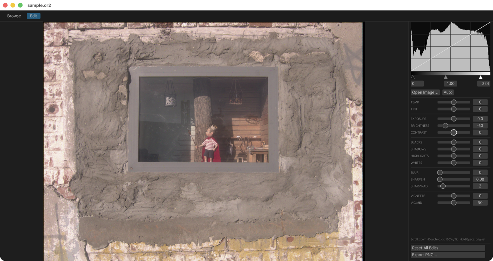

# Image Processor

A fast GPU image editor in Rust — wgpu compute shaders + egui. Every adjustment
runs as a compute pass on the GPU, so editing stays real-time even on large
images.



## Features

- **Browse / Edit tabs** — folder thumbnail browser (background-threaded
  loading) and a full editor; click a thumbnail to edit it
- **Formats** — PNG, JPEG, TIFF, BMP, WebP, GIF, and camera RAW
  (DNG, CR2, CR3, NEF, ARW, ORF, RW2, RAF, PEF, …) via rawloader/imagepipe
- **Fast RAW opens** — RAW files open from the embedded JPEG first via
  [`jpgfromrawlib`](https://github.com/ioma8/jpgfromrawlib), then the full
  demosaic swaps in shortly after if you stay on that image
- **RAW development** — the "Develop RAW" button re-renders the DNG with a
  small, deterministic pipeline: rawloader decode (crop, black/white level,
  as-shot white balance, demosaic, camera→sRGB matrix) followed by one global
  phone S-curve fitted from 46 Pixel DNG/JPEG pairs
  (`models/raw_s_curve.json`, a few KB), with each image auto-exposed to the
  median linear luminance before the curve. No neural network. Refit the
  curve with `cargo run --release -- --fit-raw-scurve <folder>`
- **Adjustments** — white balance (temp/tint), exposure (stops),
  brightness (Capture One-style midtone bias), contrast (logistic S-curve),
  blacks/shadows/highlights/whites tonal zones, box blur, unsharp mask,
  vignette — all hue-preserving (computed on luminance)
- **Levels** — draggable black/gamma/white handles under the live
  GPU-computed luminance histogram
- **Curves** — Photoshop-style: click the histogram to add points,
  natural cubic spline, applied as a 256-entry LUT
- **Auto** — one-click auto levels, brightness, contrast,
  shadows/highlights from the histogram
- **Reference look transfer** — capture a finished photo's look, apply it to
  RAW or standard images through one constrained model, and teach the model
  from approved edits directly in the editor
- **Persistent edits** — every image's edit state is saved to SQLite
  (`~/.image-processor/edits.db`) and restored when reopened;
  Reset All Edits reverts to defaults
- **Culling** — 1–5 star ratings, pick/reject flags (P/X), color labels
  (6–9), saved in SQLite independently of edits; badges in the grid and
  filmstrip
- **Filmstrip & navigation** — Left/Right arrows move through the folder in
  Edit view (filmstrip at the bottom) and Browse (grid selection, Enter opens)
- **Filter & sort** — show all/picks/rejects/unflagged, minimum star rating,
  sort by name or date
- **Bulk file ops** — trash rejects, move rejects to a folder, copy picks to
  a folder; SQLite rows follow moved/copied files
- **Export** — save the processed result as PNG

## Run

```bash
cargo run --release                  # empty start
cargo run --release -- photo.cr2     # open an image
cargo run --release -- ~/Pictures    # browse a folder
```

## Editor shortcuts

- Scroll: zoom · drag: pan · double-click: 100% / fit
- Hold mouse or Space: show original
- 1–5: rate · 0: clear rating · P: pick · X: reject · 6–9: color label
- Left/Right: previous/next image · Enter (Browse): open selected
- Double-click a slider: reset it
- Curves: click to add a point, right-click or drag out to remove,
  double-click to reset
